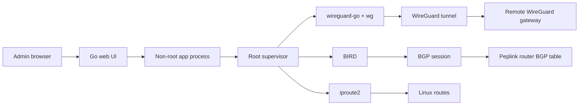

# Peplink WG BGP

Peplink WG BGP is a small containerized control plane for running a
WireGuard tunnel and BGP routing peer from Peplink container hosting
environments. It provides a lightweight web UI for importing WireGuard config,
generating BIRD configuration, applying routing state, and checking tunnel and
BGP status.

The current target is a Peplink device running a Linux container with
`NET_ADMIN` and `/dev/net/tun` access. The app uses `wireguard-go`,
`wireguard-tools`, BIRD, and a small Go web server with a root supervisor for
the network operations that require elevated privileges.

## Quick Start

Coming soon.

## Screenshots

### Management Dashboard

### Peplink BGP Status

## Architecture

The web process handles UI, config validation, CSRF/session protection, and
status rendering. Privileged operations are routed through a Unix socket to a
small supervisor that only runs fixed, allowlisted WireGuard, BIRD, and routing
actions.

Runtime state is stored under `/app-state` so the container can work on devices
where bind mounts are not available. The app currently publishes
architecture-specific Docker tags such as `*-arm64` and `*-amd64`.

## Features

- Import and persist WireGuard configuration.
- Generate BIRD BGP configuration from form fields.
- Apply, restart, and stop the routing stack from the dashboard.
- Show WireGuard handshake, endpoint, transfer counters, and keepalive state.
- Show BGP state, neighbor, ASNs, and route counters.
- Provide read-only diagnostics for network state.
- Run the web app as a non-root user while isolating privileged network actions
  in a supervisor process.

## Status

This project is early and field-tested against a Peplink container environment.
Expect the configuration model, deployment notes, and operational safety checks
to evolve.

Tested hardware:

- Peplink MAX Transit Duo Pro
- Firmware 8.5.4 build 6264

## Security Notes

This container performs privileged network operations and should only be exposed
on trusted management networks. The UI is protected by a generated login token,
HTTP-only session cookies, CSRF checks for unsafe methods, and server-side input
validation, but it is still an administrative interface for route and tunnel
control.

Docker image scanners may report vulnerabilities from packaged runtime tools,
especially `wireguard-go`. Treat scanner output as actionable input, but verify
reachability and runtime exposure before making operational decisions.

## License

MIT. See [LICENSE](LICENSE).
