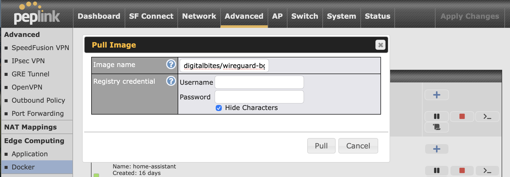
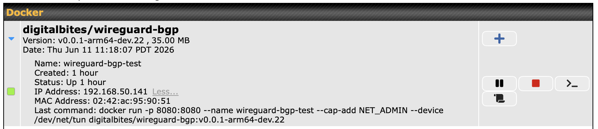
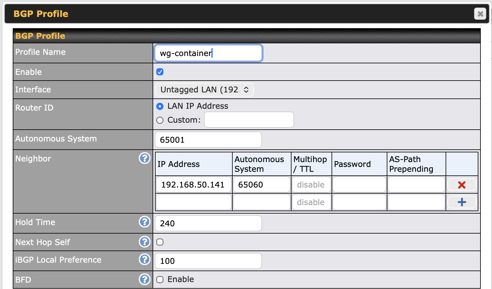
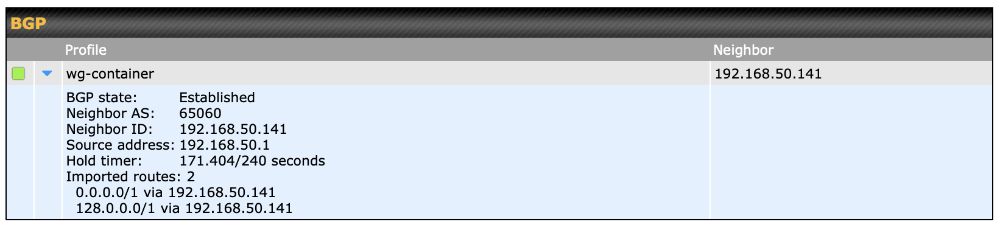
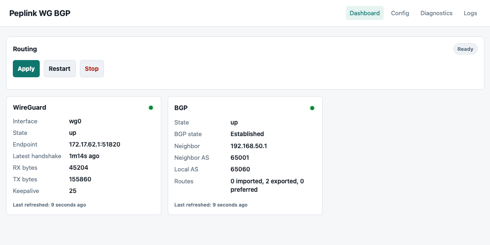
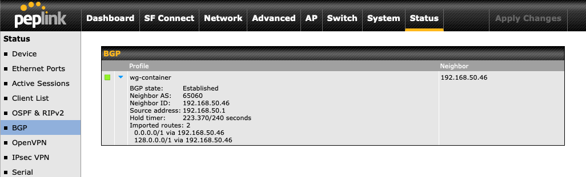
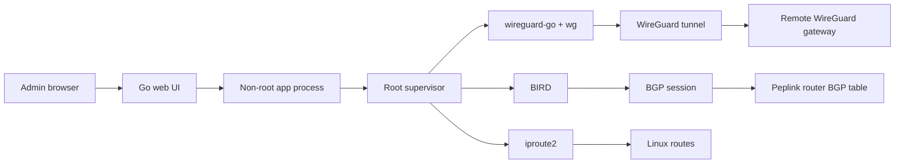
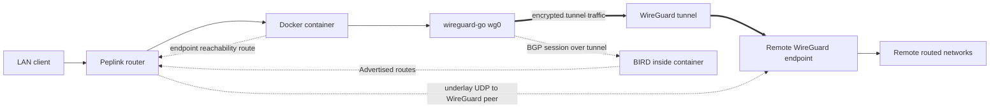

# WireGuard BGP - Router Companion

WireGuard BGP is a small containerized control plane for running a
`wireguard-go` tunnel on small mobile routers, such as Peplink devices that
support containers. It provides a lightweight web UI for importing WireGuard
config, generating BIRD configuration to advertise routes back to the router,
applying routing state, and checking tunnel and BGP status.

The current target is a Peplink device running a Linux container with
`NET_ADMIN` and `/dev/net/tun` access. The app uses `wireguard-go`,
`wireguard-tools`, BIRD, and a small Go web server with a root supervisor for
the network operations that require elevated privileges.

## Quick Start

These steps are intended to get a tunnel up and running. They do not cover the
full details of network routing, remote firewall rules, remote route
advertisements, or endpoint design. You need a working WireGuard endpoint before
starting.

### Configure + Start Container

1. Log in to your Peplink router.
2. Navigate to Advanced > Edge Compute > Docker.
3. Select "Click here to pull Docker image."
4. Enter the desired image name. In this example, use `digitalbites/wireguard-bgp:v0.0.1-arm64-dev.22`.
   
5. Click Pull and wait for the image to install.
6. Click "+" to add a new running container instance. When prompted for the Docker run command, use: `docker run -p 8080:8080 --name wireguard-bgp --cap-add NET_ADMIN --device /dev/net/tun --restart unless-stopped digitalbites/wireguard-bgp:v0.0.1-arm64-dev.22`
   
7. Copy the IP address from the updated screen.
8. View the logs using the paper scroll icon and copy the login token.

### Configure Tunnel + Route Advertisement

1. Open a new browser tab and navigate to `http://<container-ip>:8080`, then enter the login token.
2. Paste your WireGuard configuration in WireGuard, then click "Save WireGuard."
3. Configure BIRD under Advertise Routes.
4. Set Router ID to the container IP address. In this example, use `192.168.50.141`.
5. Set Local ASN to `65060`, Peer ASN to `65001`, and Peer IP to your Peplink management/LAN IP. In this example, use `192.168.50.1`.
6. Leave Interface set to `wg0`.
7. For Advertised Routes, keep the example entry for all traffic or list specific subnets to route over the tunnel.
8. Click "Save BIRD."
9. Click Dashboard > Apply.

### Configure Peplink BGP

1. Log in to your Peplink router.
2. Navigate to Advanced > Routing Protocols > BGP.
3. Configure matching settings from the section above.
   

### Confirm BGP Route Advertisement

1. Log in to your Peplink router.
2. Navigate to Status > BGP.
   

### Test!

## Screenshots

### Management Dashboard



### Peplink BGP Status



## Architecture



The web process handles UI, config validation, CSRF/session protection, and
status rendering. Privileged operations are routed through a Unix socket to a
small supervisor that only runs fixed, allowlisted WireGuard, BIRD, and routing
actions.

### Traffic Flow



Client traffic that matches BGP-learned or configured tunnel routes is sent by
the Peplink router to the container, then through `wireguard-go` and the
WireGuard tunnel. The WireGuard peer endpoint itself is pinned back through the
Peplink router's normal underlay path so the tunnel's own UDP transport does not
get routed back into `wg0`.

Runtime state is stored under `/app-state` so the container can work on devices
where bind mounts are not available. The app currently publishes
architecture-specific Docker tags such as `*-arm64` and `*-amd64`.

## Features

- Automatic routing changes on tunnel up/down via BGP.
- Import and persist WireGuard configuration.
- Generate BIRD BGP configuration from form fields.
- Apply, restart, and stop the routing stack from the dashboard.
- Show WireGuard handshake, endpoint, transfer counters, and keepalive state.
- Show BGP state, neighbor, ASNs, and route counters.
- Provide read-only diagnostics for network state.
- Run the web app as a non-root user while isolating privileged network actions
  in a supervisor process.

## Performance

The main constraint with running WireGuard on these devices is that the vendor
does not currently ship kernel WireGuard support. The available option is
`wireguard-go`, which is not expected to perform at the same level as kernel
WireGuard.

In field testing, performance has been acceptable for this use case.

### WireGuard DOWN - 1 Gbps wired path over WAN

```bash
# traceroute -I 172.17.62.160
traceroute to 172.17.62.160 (172.17.62.160), 30 hops max, 46 byte packets
 1  max-tst-de45 (192.168.50.1)  0.019 ms  0.010 ms  0.005 ms
 2  172.17.62.1 (172.17.62.1)  0.250 ms  0.358 ms  0.379 ms
 3  172.17.62.160 (172.17.62.160)  0.937 ms  0.646 ms  0.798 ms

# iperf3 -c 172.17.62.160
Connecting to host 172.17.62.160, port 5201
[  5] local 192.168.50.46 port 54764 connected to 172.17.62.160 port 5201
[ ID] Interval           Transfer     Bitrate         Retr  Cwnd
[  5]   0.00-1.00   sec   111 MBytes   933 Mbits/sec  309    465 KBytes
[  5]   1.00-2.00   sec   112 MBytes   935 Mbits/sec    0    613 KBytes
[  5]   2.00-3.00   sec   110 MBytes   926 Mbits/sec    0    735 KBytes
[  5]   3.00-4.00   sec   110 MBytes   922 Mbits/sec    0    838 KBytes
[  5]   4.00-5.00   sec   103 MBytes   860 Mbits/sec    0    895 KBytes
[  5]   5.00-6.00   sec   106 MBytes   886 Mbits/sec    0    931 KBytes
[  5]   6.00-7.00   sec   112 MBytes   942 Mbits/sec    2    759 KBytes
[  5]   7.00-8.00   sec   111 MBytes   934 Mbits/sec    0    859 KBytes
[  5]   8.00-9.00   sec   109 MBytes   909 Mbits/sec    4    664 KBytes
[  5]   9.00-10.00  sec   108 MBytes   913 Mbits/sec    0    775 KBytes
- - - - - - - - - - - - - - - - - - - - - - - - -
[ ID] Interval           Transfer     Bitrate         Retr
[  5]   0.00-10.00  sec  1.07 GBytes   916 Mbits/sec  315            sender
[  5]   0.00-10.01  sec  1.06 GBytes   913 Mbits/sec                 receiver

iperf Done.
```

### WireGuard UP - 1 Gbps wired path over wg0 tunnel

```bash
# traceroute -I 172.17.62.160
traceroute to 172.17.62.160 (172.17.62.160), 30 hops max, 46 byte packets
 1  10.0.15.1 (10.0.15.1)  0.966 ms  1.022 ms  0.675 ms
 2  172.17.62.160 (172.17.62.160)  1.079 ms  0.977 ms  0.989 ms
# iperf3 -c 172.17.62.160
Connecting to host 172.17.62.160, port 5201
[  5] local 192.168.50.46 port 53644 connected to 172.17.62.160 port 5201
[ ID] Interval           Transfer     Bitrate         Retr  Cwnd
[  5]   0.00-1.00   sec  36.2 MBytes   304 Mbits/sec    0   1.39 MBytes
[  5]   1.00-2.00   sec  30.0 MBytes   252 Mbits/sec    5   2.00 MBytes
[  5]   2.00-3.00   sec  23.5 MBytes   197 Mbits/sec    0   2.00 MBytes
[  5]   3.00-4.00   sec  23.6 MBytes   198 Mbits/sec    0   2.01 MBytes
[  5]   4.00-5.00   sec  33.2 MBytes   279 Mbits/sec    0   2.02 MBytes
[  5]   5.00-6.00   sec  28.5 MBytes   239 Mbits/sec    0   2.03 MBytes
[  5]   6.00-7.00   sec  28.6 MBytes   240 Mbits/sec    0   2.07 MBytes
[  5]   7.00-8.00   sec  29.5 MBytes   248 Mbits/sec    0   2.12 MBytes
[  5]   8.00-9.00   sec  25.1 MBytes   211 Mbits/sec    0   2.19 MBytes
[  5]   9.00-10.00  sec  26.1 MBytes   219 Mbits/sec    0   2.28 MBytes
- - - - - - - - - - - - - - - - - - - - - - - - -
[ ID] Interval           Transfer     Bitrate         Retr
[  5]   0.00-10.00  sec   284 MBytes   239 Mbits/sec    5            sender
[  5]   0.00-10.07  sec   276 MBytes   230 Mbits/sec                 receiver

iperf Done.
```

## Status

This project is early and field-tested against a Peplink container environment.
Expect the configuration model, deployment notes, and operational safety checks
to evolve.

Tested hardware:

- Peplink MAX Transit Duo Pro: Firmware 8.5.4 build 6264

## Limitations

- Performance may also be limited by the connection medium, such as cellular or
  Starlink.
- Only a single tunnel definition is currently supported.
- Requires container runtime support on the router.

## Security Notes

This container performs privileged network operations and should only be exposed
on trusted management networks. The UI is protected by a generated login token,
HTTP-only session cookies, CSRF checks for unsafe methods, and server-side input
validation, but it is still an administrative interface for route and tunnel
control.

Docker image scanners may report vulnerabilities from packaged runtime tools,
especially `wireguard-go`. Treat scanner output as actionable input, but verify
reachability and runtime exposure before making operational decisions.

## License

MIT. See [LICENSE](LICENSE).
